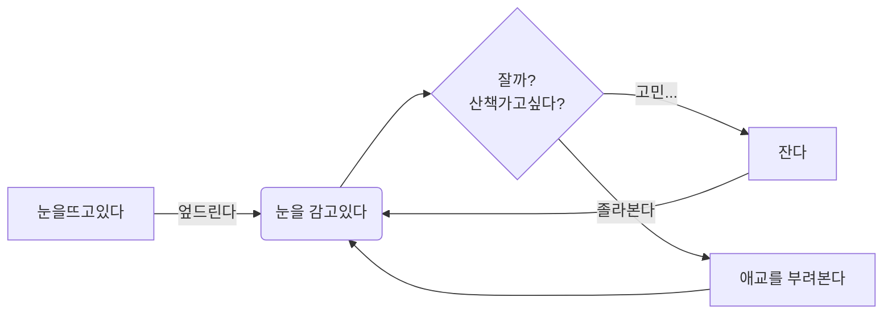

<script src="https://cdn.jsdelivr.net/npm/mermaid/dist/mermaid.min.js"></script>

# Markdown
- 마크다운은 언어다. 마크업 언어다. 
  - 즉, 텍스트를 작성하면 미리 정해둔 규칙에 따라 보여지는 형식이 정해져 있는 언어이다.
    - 예시
      - "# " 이것은 #과 공백이다. "# 제목"이라고 쓰면 큰제목으로 보인다. browser가 가진 가장 큰제목 h1사이즈로 보여진다. h6 사이즈까지 표현가능하며, #의 개수와 h의 숫자가 일치한다. #이 많을 수록 제목이 작아진다.
      - 제목을 쓰면, 문서상단에 [toc] 라는 총 5글자(?)만으로 목차가 자동 생성된다.
  - 띄어쓰기나 탭, 줄바꿈등은 마크다운에서 약속되어져 있는 규칙과 관련이 있으니 제대로 반영되지 않을때는 혹시 간과하지 않았는지 확인하는 것도 도움이 된다. 아래를 따라해보기를 바란다.
- 문서저장형식이다. md 라는 확장자로 저장된다.
    - 마크다운은 매우 작성하기 쉽고, *툴의 도움*을 받으면 여러가지 문서형식으로 변환이 자유롭다. 한번 작성으로 여러 형식으로 내보내기 가능하다.
        - html, pdf는 기본 docx, LaTex, image, epub 등 다양한 형태로 변환이 가능하다.  


#### 따라 해보기
  [툴](#마크다운-작성-툴)을 열여 아래를 복사해서 붙여넣으면 확인가능.

```markdown

[toc]

# 제목

## 제목2

### 제목3

#### 제목4

##### 제목5

###### 제목6-a

####### 제목7 요건 안되지...

###### 제목6-b

```

- 마크다운은 배우기 쉽다. 작성도 쉽고, 변환도 쉽다.

- 그래서 온라인게시물에 참좋은 언어이다.

- 꼭, 적용해보기를 바란다.


## 마크다운 작성 툴

- 메모장 : 결과를 보기도, 변환하기도 어렵지만 작성은 할 수 있다.

- vscode : 작성과 결과확인하기 좋다. 이것 저것 플러그인을 많이 깔아두지 않았다면 매우 가벼울것.

- typora : 작성과 결과확인 그리고 문서변환이 쉽고 다양하다.

- aiwriter : ios에 최적화 유료

  모든 툴이 마크다운을 모두 따르는것도 아니고 미리보기에 잘 보여지는 것도 아니다. 툴마다 조금의 변칙은 있다. 아마 각 프로그램의 설정에서 자신이 선호하는 방식으로 바꿀수 있다.
  

## 사용예시 
▼ 여기서부터는 먼저 결과를 보여주고, 해당 효과는 어떻게 쓸수 있는지 작성예시를 보여주는 방식으로 기술했다.
내용은 쉬운내용을 작성하기 위한것으로 강아지를 예로 들어 작성해보았다. 큰 의미는 없다.

### 강아지의 특성 (블럭)
> 강아지는 귀엽다
>> 우리집 강아지는 곱슬 강아지
>>> 곱슬이라 복슬 강아지

#### 따라 해보기
```markdown
### 강아지의 특성 (블럭)
> 강아지는 귀엽다
>> 우리집 강아지는 곱슬 강아지
>>> 곱슬이라 복슬 강아지
````
### 생물학적 분류 (표 그리기)

:ballot_box_with_check: 솔직히 엑셀에서 표그려서 타이포라에 붙여 넣는게 편하다. 그리고, 셀병합같은것은 되지 않으니 이부분은 아쉽지만 그러려니 하길 바란다.​

| 구분         | 내용                                                         |
| :----------- | ------------------------------------------------------------ |
| 학명         | *Canis lupus familiaris*                                     |
| 계           | 동물                                                         |
| 문           | 척삭동물                                                     |
| 강           | 포유류                                                       |
| 목           | 식육목                                                       |
| 과           | 개과                                                         |
| 멸종위기등급 | 미평가(NE : Not Evaluated, 출처 : IUCN) [dog, 犬] (두산백과) |

#### 따라 해보기
```markdown
### 생물학적 분류 (표그리)
| 구분         | 내용  |
| :--- | --- |
| 학명         | *Canis lupus familiaris*  |
| 계           | 동물 |
| 문           | 척삭동물 |
| 강           | 포유류 |
| 목           | 식육목 |
| 과           | 개과 |
| 멸종위기등급 | 미평가(NE : Not Evaluated, 출처 : IUCN) [dog, 犬] (두산백과) |
```


### 개의 종류 (리스트 순서없음)
- 시고르자브종
- 댕댕이
  - 얼룩댕댕이
  - 블랙댕댕이
    - 먹물블랙댕댕이
      - 쭈꾸미먹물시크블랙댕댕이
    - 티타늄블랙댕댕이
  - 화이트댕댕이
+ 품종견
    - 아브다카다브라품종
        * 수리수리마하수리종
            + 댕댕이는귀여워용  
        

"- " 로 작성하고 뎁스는 텝으로 구분해주면 됨.
혹은 + - * 를 탭과 함께 혼용해서 써도 됨.

#### 따라 해보기
```markdown
### 개의 종류 (리스트 순서없음)
- 시고르자브종
- 댕댕이
    - 얼룩댕댕이
    - 블랙댕댕이
        - 먹물블랙댕댕이
        - 티타늄블랙댕댕이
    - 화이트댕댕이
+ 품종견
    - 아브다카다브라품종
        * 수리수리마하수리종
            + 댕댕이는귀여워용    
```


### 개가 좋아하는 간식 (리스트 순서있음)

1. 오리목뼈
2. 생닭
   1. 하림

#### 따라 해보기
```markdown
### 개가 좋아하는 간식 (리스트 순서있음)
1. 오리목뼈
2. 생닭
   1. 하림
```


### 개를 위한 찬가 (진하게,기울기,인용구, 취소선, 밑줄 등)

우리 집 강아지는 **복슬** 강아지 학교 갔다 돌아오면 *멍멍멍* 

`쫄랑쫄랑` 따라가며 <u>멍멍멍</u>

때로은 <del>꽥꽥꽥 야옹 야옹</del> // ~~꽥꽥꽥 야옹 야옹~~

#### 따라 해보기
```markdown
### 개를 위한 찬가 (진하게,기울기,인용구, 취소선 등)
우리 집 강아지는 **복슬** 강아지 학교 같다 돌아오면 *멍멍멍* 

`쫄랑쫄랑` 따라가며 <u>멍멍멍</u>

때로은 <del>꽥꽥꽥 야옹 야옹</del> // ~~꽥꽥꽥 야옹 야옹~~

```


### 말 잘 듣는 개 만들기(코드블럭가능)

- 간식을 주고 간식이 맘에 들면 GoodDog이 되고 아니면 Lazy한 개가 되는 소스코드이다.
```java
public class GoodDog{
	public static void main(String[] args){
		Dog yourDog = beAGoodDog("오리목뼈");
		System.out.println(yourDog.toString());
	}
	
	private Dog beAGoodDog(String trit){
		Dog dog = null;
		boolean doesDogLikeTrit = doesDogLikeTrit(trit);
		if(doesDogLikeTrit){
			dog = new GoodDog();
		}else{
			dog = new LazyDog();
		}
		return dog;
	}
}
```

#### 따라 해보기
```markdown
### 말 잘 듣는 개 만들기(코드블럭가능)
- 간식을 주고 간식이 맘에 들면 GoodDog이 되고 아니면 Lazy한 개가 되는 소스코드이다.
```java
public class GoodDog{
	public static void main(String[] args){
		Dog yourDog = beAGoodDog("오리목뼈");
		System.out.println(yourDog.toString());
	}
	
	private Dog beAGoodDog(String trit){
		Dog dog = null;
		boolean doesDogLikeTrit = doesDogLikeTrit(trit);
		if(doesDogLikeTrit){
			dog = new GoodDog();
		}else{
			dog = new LazyDog();
		}
		return
	}
}
```


#### 따라해보기

```markdown

    ```flow
    st=>start: 하루시작
    op1=>operation: 눈은 뜨고 있지만 움직이지 않고
    엄빠 머하는지 지켜보기
    op3=>operation: 밥시간이다
    cond=>condition: 밥을 먹는다?
    op2=>operation: 단식을 해본다 
    op4=>operation: 간식이 주어진다.
    e=>end: 오늘하루 끝 내일은 내일의 간식이 있다.
    
    st->op1->op3->cond
    cond(yes,left)->op4->e
    cond(no@단식투쟁!!, bottom)->op3
```


<script>mermaid.initialize({startOnLoad:true});</script>

### 강아지 디디의 하루 순서(Mermaid.js 활용가능)

- mermaid는 다양한 diagram을 지원한다.
- 해당 블로그는 github-page를 이용하고 있어 mermaid.js 렌더링을 위해, 다른 방법을 사용했으나, 그 경우가 아니라면 무난히 성공할 것이다.

<div class="mermaid"> 
graph LR
    A[눈을뜨고있다] -->|엎드린다| B(눈을 감고있다)
    B --> C{잘까?<br/>산책가고싶다?}
    C -->|고민...| D[잔다]
    C -->|졸라본다| E[애교를 부려본다]
    D & E --> B
</div>

#### 따라 해보기
```markdown
### 강아지 디디의 하루 순서(Mermaid.js 활용가능)
- mermaid는 다양한 diagram을 지원한다.

- github 페이지를 이용해 블로그를 하는경우  지킬(jekyll 테마)를 적용한 경우 혹은  github-page자체로 인해 렌더링이 되지 않는경우 : 
1. js를 import하고, 
2. 초기 메서드를 호출하고, 
3. 적용받을  div로 감싸주는 것으로 적용이된다.

```html
    <!-- 마크다운 문서상단, 야믈 프론트 매터스 다음에 위치 -->
    <script src="https://cdn.jsdelivr.net/npm/mermaid/dist/mermaid.min.js"></script>
    <script>mermaid.initialize({startOnLoad:true});</script>
    
    <!--머메이드 적용할 곳에 감싸준다-->
    <div class="mermaid"> 
        graph TD
        ..
    </div>
```

### 강아지 디디의 하루 순서(flow)
마찬가지로 github 페이지를 이용해 블로그를 하는경우 해당 플러그인은 지원하지 않는다.
여기서 주의할 점은 코드펜스에서 해당툴의 markdown 프로세서에 따라 지원하는 언어가 다르다는 점이다. 
즉, **``` ```** 이렇게 하면 코드펜스 자체가 되고, **```language ```** 를 표기하면 그 언어에 맞는 하이라이팅 기능을 제공하는데 그 언어가 다르다는 것이다.
하지만, 타이포라를 이용하면 아래 코드는 잘 렌더링 된다. 렌더링 결과는 아래 그림이다.
디디의하루

#### 따라 해보기
```markdown
    ```flow
    st=>start: 하루시작
    op1=>operation: 눈은 뜨고 있지만 움직이지 않고
    엄빠 머하는지 지켜보기
    op3=>operation: 밥시간이다
    cond=>condition: 밥을 먹는다?
    op2=>operation: 단식을 해본다 
    op4=>operation: 간식이 주어진다.
    e=>end: 오늘하루 끝 내일은 내일의 간식이 있다.
    
    st->op1->op3->cond
    cond(yes,left)->op4->e
    cond(no@단식투쟁!!, bottom)->op3
    ```
```


### 강아지 디디의 셈법

$$
관절영양제 5알이 들어간 약통에서 5개의 간식을 꺼내먹었다. 몇개의 간식이 남았을까?
$$

$$
5-5= 하나더 있을지도 모른다는 희망
$$

```
#### 따라 해보기
```markdown
### 강아지 디디의 셈법

$$
	관절영양제 5알이 들어간 약통에서 5개의 간식을 꺼내먹었다. 몇개의 간식이 남았을까?
$$

$$
	5-5= 하나더 있을지도 모른다는 희망
$$
```
### 강아지 디디의 오늘의 먹거리(to먹리스트 - task list 구현)
- [x] 아침 사료
- [ ] 점심 관절 영양제
- [ ] 저녁 사료
- [ ] 간식
- [ ] 간식
- [ ] 간식

#### 따라 해보기
```markdown
### 강아지 디디의 오늘의 먹거리(to먹리스트 - task list 구현)
- [x] 아침 사료
- [ ] 점심 관절 영양제
- [ ] 저녁 사료
- [ ] 간식
- [ ] 간식
- [ ] 간식
```
### 강아지 디디 소개글
디디[^1]  강아지는, 토이푸들[^toy-poodle]이라고 한다.

[^1]: 강아지 이름은 디디이다 띨띨이라고 하는 사람도 있는데 그건 오해다. 똘똘이라고 해도 좀 그렇다.

[^toy-poodle]: 11평 내집에서도 답답하지 않았으면 했다. 그러나 디디는 먹성이 좋았다. 지금은 토이푸들2마리반정도.

    지금은 편식쟁이에 틈만나면 단식을 감행하여 보호자와 대치한다. 매번 패배하면서 왜 하는지.... 안타깝다.
    
    `{ 디디 == 맛있는 것 만 먹고 싶다. }`
    
    하하 :joy: 

#### 따라 해보기
```markdown
### 강아지 디디 소개글
디디[^1]  강아지는, 토이푸들[^toy-poodle]이라고 한다.

[^1]: 강아지 이름은 디디이다 띨띨이라고 하는 사람도 있는데 그건 오해다. 똘똘이라고 해도 좀 그렇다.

[^toy-poodle]: 11평 내집에서도 답답하지 않았으면 했다. 그러나 디디는 먹성이 좋았다. 지금은 토이푸들2마리반정도.

    지금은 편식쟁이에 틈만나면 단식을 감행하여 보호자와 대치한다. 매번 패배하면서 왜 하는지.... 안타깝다.
    
    `{ 디디 == 맛있는 것 만 먹고 싶다. }`
    
    하하 :joy: 
```


### 강아지 디디의 그림일기
디디:dog2:는 오늘 다른 친구(:dog:)를 만났다. 날씨는 아주 맑았다(:sunny:)
맛있는거:poultry_leg:나 맛있는거:meat_on_bone:를 먹기:yum: 좋은 날인것 같다.
[이모지 리스트](https://gist.github.com/rxaviers/7360908)

#### 따라 해보기
```markdown
### 강아지 디디의 그림일기
디디:dog2:는 오늘 다른 친구(:dog:)를 만났다. 날씨는 아주 맑았다(:sunny:)
맛있는거:poultry_leg:나 맛있는거:meat_on_bone:를 먹기:yum: 좋은 날인것 같다.
```


---


## 맺음말

본인은 깃허브 블로그를 사용하고 있으므로, 로컬에서 바로 작성하고 바로 포스팅하는 편리함이 매우 좋다. 그리고 개발관련 문서작성시 마크다운으로만 작성하면  pdf나 docx로 바로 변환 가능한 점이 큰 장점이다. pptx로도 변환이 가능하지만 좀더 테스트를 해봐야 한다. 조금 많이 서식이 깨지기 때문이다.  나는 내 로컬pc도 데이터백업의 한 수단으로 본다. 클라우드건 대형it회사의 서비스이건 만약이라는건 존재한다. 거기에도 올리고 내pc에도 있고 그럼 이렇게 저렇게 다 좋은것 같다. 네이버 블로그를 운영한다면 md로 작성후  html로 변환하여 블로그 포스팅하는 방법이 있을 것 같다.

마크다운은 좋아좋아....

:smile:

